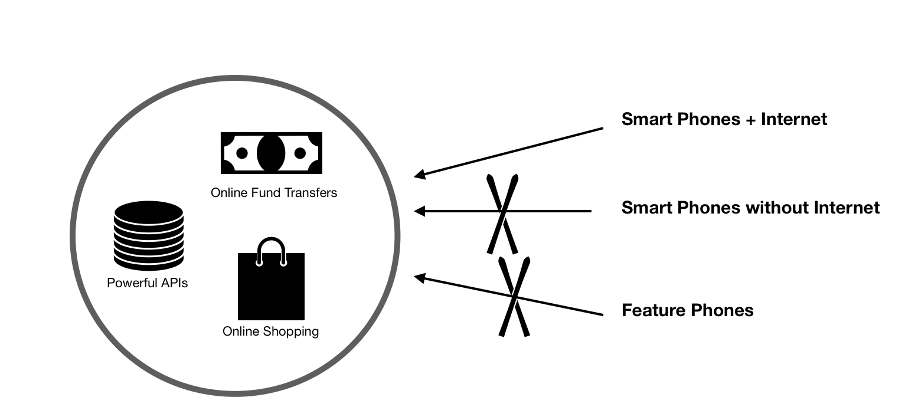

[Comment]: # (All of this is placeholder text. Use this format or any other format of your choosing to best describe your project.)

[Reminder]: # (Make sure you've submitted the Twilio CodeExchange agreement: https://ahoy.twilio.com/code-exchange-community)

[Important]: # (By making a submission, you agree to the competition's terms: https://www.twilio.com/legal/twilio-dev-hackathon-terms)

## What I built

The main purpose of UNO App is to fill the technology gap among the people. In current era, people dont have to carry cash, they dont have to do to markets to buy prodcuts or to pay utlility bills. But still there are around 4 billion people who dont have access to internet. They have to go to markets and carry cash. They have no idea of Paypal or Amazon.

In this time of pandemic, it is very dangerous to go to markets or deal in cash. But the people who are unfamiliar with the internet and smartphones have to go to markets. _Uno app_ has a feature that will connect these people to the powerful APIs such as online fund transfers, online shopping and getting aid from governement. This app exploits the information that goverments have in order to provide as much as possible ease of access to these people with the help of **feature phone** or a smartphone without internet.

#### Category Submission: 

## Demo Link

 

## Link to Code

## How I built it (what's the stack? did I run into issues or discover something new along the way?)

## Additional Resources/Info